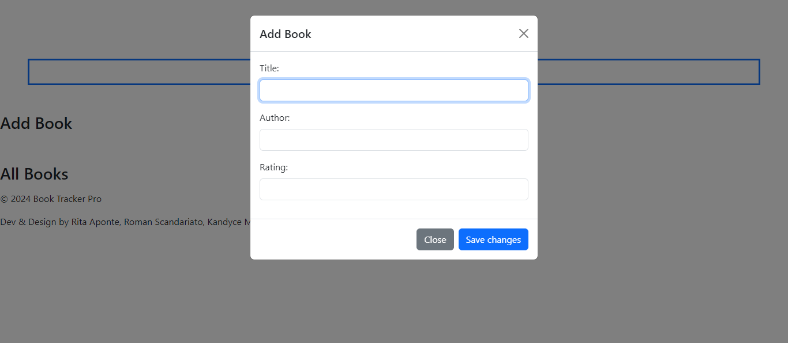
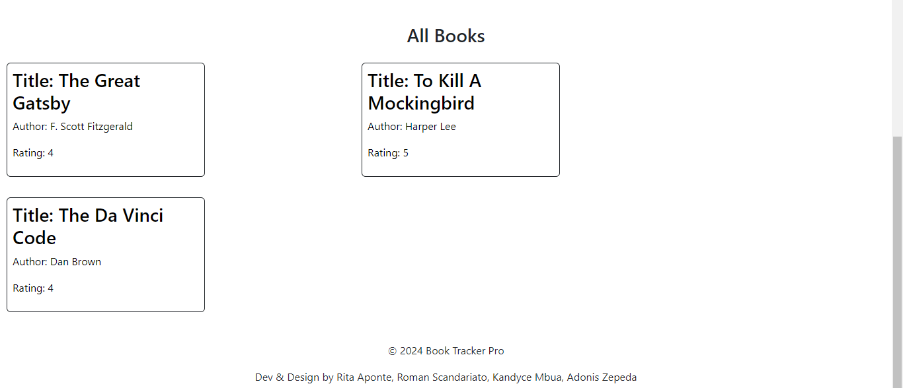

# Book-Tracker-Pro

## Description

Our project was created to provide a functional, interactive app for users to add books they have read and apply their own ratings. It is a web-based log that helps the user keep track of what books they have read and rate them on a scale of 1 to 5. Instead of having to keep a handwritten log, the user will be able to keep track on their app.

## Installation

What are the steps required to install your project? Provide a step-by-step description of how to get the development environment running.

To install this project:
1. Go to Repo and get ssh key:
https://github.com/RomanScandariato/Book-Tracker-Pro 

2. Navigate to where you want to clone the repo
cd -

3.Clone the Repository: 
git clone (ssh key)

3.Open Project in VSCode 
code . -a 

You're ready to develop!

## Usage

## Adding a book 
1. Launch the Book-Tracker-Pro application in browser

2. Click on "Add Book" button or navigate to the section where you can add a new book.

3. Fill in book Details:
    - Enter the Title of the book in the "Title" field.
    - Enter the author's name in the "Author" field.
    - Provide a rating for the book in the "Rating" field (1 to 5 stars).

4. Save the Book:
    - Click the "Save" button to add to your book list.

## Viewing Books
1. Open the Application in your browser

2. Navigate to the Book List:
    -The list of books will display in main page 

3. Browse your Books:
    -Scroll throught the list to see the books you have added, along with their details.

## Example / Image

## Credits

Shout out to our collaborators: 
- Rita Aponte (https://github.com/Accidori)
- Roman Scandariato (https://github.com/RomanScandariato)
- Kandyce Mbua (https://github.com/knmbua)
- Adonis Zepeda (https://github.com/Adonis99Jordan)

Sites used: 
- [Bootstrap](https://getbootstrap.com/)

## License

MIT License

## Features

If your project has a lot of features, list them here.

The Book Tracker Pro provides its user with the comfort of:
- Adding your favorite books into a cataloge
- Allowing the user to rate the book they have read

A simple app to manage your books and your standing on them!

## How to Contribute

[Contributor Covenant](https://www.contributor-covenant.org/)